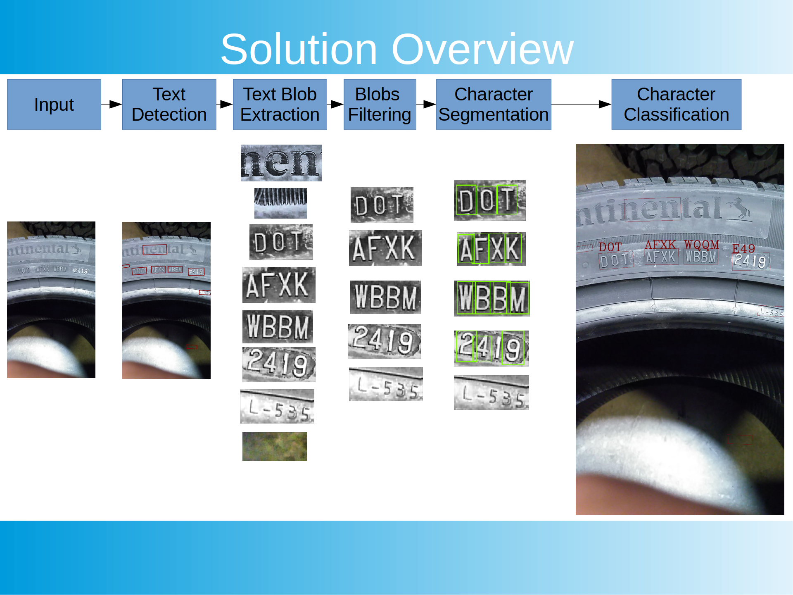

# Tire Identification Number Detection and Recognition



## Requirements
Tested on Ubuntu 18.04.

Direct dependencies: <br/>
TCLAP : libtclap-dev (official repo) <br/>
Opencv 4.1.2  <br/>
 <br/>
OpenCV was built from sources (https://github.com/opencv/opencv/tree/4.1.2 and contribs https://github.com/opencv/opencv_contrib/tree/4.1.2). <br/>
It must have Tesseract enabled <br/>
Tesseract : libtesseract4 libtesseract-dev  (official repo) <br/>
 <br/>
## HOW TO
Sample for detection and recognition : <br/>
```bash
cd [LocalPath]/samples/
mkdir build_DetectionRecognition
cd build_DetectionRecognition
cmake ../DetectionRecognition -DCMAKE_BUILD_TYPE=Release -DOPENCV_VERSION=4 -DTIN_DR_WITH_VERBOSE=ON
make -j12
```

Execution : <br/>
```bash
./DetectionRecognition -i ../../data/tin_001.jpeg -m ../../data/frozen_east_text_detection.pb -c 0.1 -n 0.1 -s -p 10
```

Help :
```bash
-o <string>,  --outputPath <string>
    Path to a directory to save detected text patches

-p <int>,  --padding <int>
    Add padding to detected area

-s,  --useSlidingWindow
    Instead of resizing the input image to 320x320, use a sliding window
    and merge detections

-n <float>,  --nmsThreshold <float>
    Non-maximum suppression threshold

-c <float>,  --confidenceThreshold <float>
    Confidence threshold

-m <string>,  --eastModelPath <string>
    (required)  Path to a binary .pb containing the trained network from
    :

    https://github.com/argman/EAST => EAST: An Efficient and Accurate
    Scene Text Detector (https://arxiv.org/abs/1704.03155v2)

-i <string>,  --inputPath <string>
    (required)  Path to an image
```
